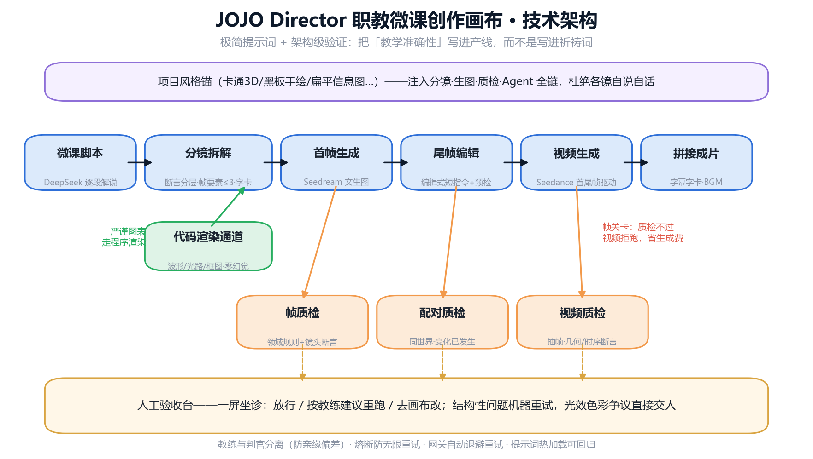

# JOJO Director

**面向职业教育的 AI 微课创作画布 —— 把"教学准确性"写进产线，而不是写进祈祷词。**

从一段文字脚本开始，自动完成 **脚本 → 分镜 → 首/尾帧 → 视频 → 质检 → 拼接成片** 的全流程，产出带字幕字卡的教学微课视频。首个完整实测作品：《LED驱动器与智慧照明控制》12 镜 / 2分08秒 / 全程无人工剪辑（成片见 [Releases](../../releases)）。



## 核心设计（为什么它和通用 AI 视频工具不一样）

通用工具判断"这张图美不美"，JOJO Director 判断"**这张图对不对**"——因为一部画面华丽但把占空比讲错的微课，比没有微课更糟糕。

- **分镜即合同**：每个镜头拆解出可核验的断言（"左侧水管必须从粗变细"），断言分层（静帧考构图、视频考时序）
- **AI 质检官**：视觉大模型按断言逐条判卷；判官与教练分离（防"自己改的作业自己打分"的亲缘偏差）
- **帧关卡**：首尾帧质检不过，视频拒跑——最贵的环节前置拦截
- **人工验收台**：光效/风格类没有标准答案的判断交给人，一屏坐诊：放行 / 按建议重跑 / 手改
- **代码渲染通道**：波形、光路、框图这类"必须严谨"的画面用程序直接画，零幻觉零 API 费
- **MAAO 路由引擎**（v0.3 新增）：基于实测能力地图，在分镜期就避开模型的已知弱区——详见下文

## MAAO：模型感知型自适应组织（本项目的方法论）

完整规范见 [docs/MAAO_Runtime_Specification_v0.3.md](docs/MAAO_Runtime_Specification_v0.3.md)。核心思想：

> 一个 Agent 系统不应该先问"我要创建多少个 Agent"，而应该先问"**我手里的模型在这个具体任务上到底可靠到什么程度**"。

本仓库实现了 MAAO 的最小落地：[`backend/capability_map.yaml`](backend/capability_map.yaml)（能力四档 HIGH/MEDIUM/LOW/UNKNOWN + 证据计数 + 路由规则，热加载）+ 分镜期确定性路由引擎 + 质检判决自动回写证据台账 + Route Regret 报表。

实测数据：LED 微课项目全生命周期成本 ¥59，其中 **47%（¥27.7）是"明知模型不行还往上撞"造成的 Route Regret**——路由引擎的目标就是把这 47% 归零。

已实证的模型能力边界（2026-07，Seedream 4.5 / 5.0 Pro + Seedance 2.0 mini）：

| 任务特征 | 实测结论 | 自动路由 |
|---|---|---|
| 连接拓扑（谁接谁） | 文生图错接高发 | → 代码渲染 |
| 亮度/颜色方向变化 | 编辑模型常做反 | → 移交视频阶段渐变，转单帧驱动 |
| 画面内文字 | 中文必乱码 | → 合成期字幕字卡 |
| 精确数量（恰好N个） | 常 ±1~2 | → 断言自动加容差 |

## 快速上手（5 分钟）

**前置条件**：Python 3.11+、Node 18+、ffmpeg，以及一个[火山方舟](https://console.volcengine.com/ark)账号（**自备 API Key，费用自理**——一部 2 分钟微课的直接生成成本约 30-60 元人民币）。

```bash
# 1. 后端
cd backend
pip install -r requirements.txt
cp .env.example .env            # 填入你的 ARK_API_KEY
# 编辑 providers.yaml：把 routes 里的模型 ID 换成你在方舟开通的推理接入点
python -m uvicorn app.main:app --port 8000

# 2. 前端（另开终端）
cd frontend
npm install
npm run dev                     # 打开 http://localhost:5173
```

首页输入"今天要做点什么微课？"→ Agent 规划分镜 → 逐镜生产（帧→质检→视频→质检）→ 🩺 验收台坐诊 → 拼接成片。

## 目录结构

```
backend/
  app/                 FastAPI 后端：节点执行器、Ark 网关、质检、MAAO 路由引擎
  prompts/             极简提示词（热加载，改文件即生效；legacy/ 存放已淘汰的重型版）
  qc_rules/            领域质检规则包（光学/机械/运动学…）+ 失败分类词表
  capability_map.yaml  MAAO 能力地图（四档 + 证据计数 + 路由规则）
  providers.yaml       模型路由与单价表（换模型只改这个文件，代码零改动）
  app/render/          代码渲染模板（PWM 波形/透镜光路/框图/工位循环…）
  tests/regression.py  回归基线（改提示词/换模型后必跑）
frontend/              React + React Flow 画布：首页 / 画布 / 验收台
docs/                  MAAO 方法论规范 + 架构图 + 展示页
```

## 实测数据（诚实披露）

- 首轮端到端测试暴露 **42 个问题**，归纳为六个病灶，全部机制化修复（详见 MAAO 文档 E1 案例：DALI / LF13 / LED）
- 视频模型（mini 挡 720p）对小人肢体仍会穿模、多步时序动作常做一半——这是当前模型能力边界，非框架能解决，升档可缓解
- 质检判官存在少量误判——所以人工终裁是双向纠错，永远保留

## License

Apache-2.0 · Copyright 2026 Baggio200cn

教学演示成片与文档中的生成内容均由 JOJO Director 产线自动生成。
